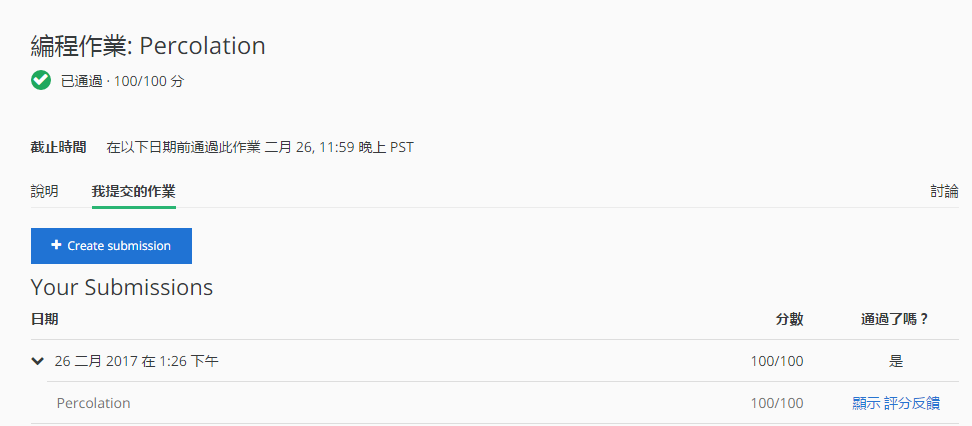

# Programming Assignment 1: Percolation

## [specification](http://coursera.cs.princeton.edu/algs4/assignments/percolation.html)

## [checklist](http://coursera.cs.princeton.edu/algs4/checklists/percolation.html)

*代码编码必须为UTF8*

## 部分解题思路
由于选用加权 quick-union算法 需要一个由二维向一维的映射

题目中判断是否浸透的模型已经在相关授课[视屏]()中描述  实现需要注意当选择开放的区域处在边界时 如何保证与四周联通时不越界

而该题的难点是在于如何判断`full open site`,若采用题目所给模型在顶部与底部均添加一个节点  则会导致在浸透时  与底部节点相连但不与 `full open site `相连的节点通过底部节点相连而导致错误 如图

## 部分个人实现

若为了保证`full open site`的准确，删除底部添加的节点，则会导致判断是否联通需要判断顶部添加节点和所有底部节点是否联通 ，算法效率急剧下降。

故另开辟一个WeightedQuickUnionUF示例用来准确判断`full open site`

    OpenSites = new WeightedQuickUnionUF(n * n + 2) ;
    //所使用的数组由于在sites顶和底另外各设置了一个节点 所以数组大小为n*n+2, [0]为顶部 [n*n+1]为底部
    FullOpenSites = new WeightedQuickUnionUF(n * n + 1);
    //为了正确得出full open site 建立另一个并查集 并且删去底节点

## 详细代码
  [Percolation.java](代码\Percolation.java)

  [PercolationStats.java](代码\PercolationStats.java)
  

## 完成度
