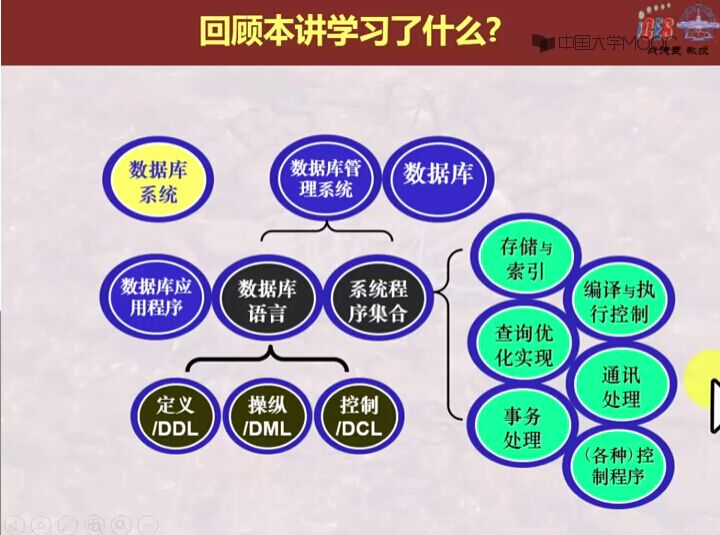

# 数据库相关术语

## DB   DataBase    数据库
### 相互有关联关系的table的集合
## DBMS DataBase Management System 数据库管理系统
## DBAP DataBase Application 数据库应用
## DBA DataBase Administrator 数据库管理员
## DDL Data Definition Language 数据定义语言
## DML Data Manipulation Language 数据操纵语言
## DCL Data Control Language 数据控制语言

## Table 表 
### Table 中描述了一批相互有关联关系的数据 → 关系
## 关系 二维表
## 元组/行/记录 tuple/row/record
## 属性/列/数据项/字段 column/field/attribute/data item
